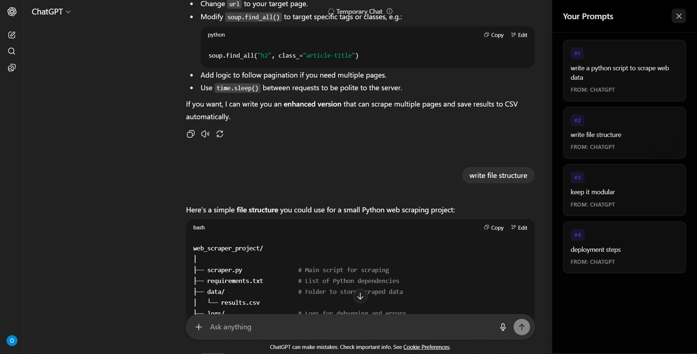

# AI Chat Navigator

> **Why I Built This**: I found similar extensions online, but they didn't work the way I wanted. Most were clunky, had poor detection, or cluttered the interface. So I decided to create my own clean, efficient solution.

A Chrome extension that works across **all major AI chat platforms**. It automatically extracts and lists your prompts in chronological order (#1, #2, #3...), letting you instantly jump to any part of your conversations.

## What It Does

- **Universal Support** - Works on ChatGPT, Claude, Gemini, Perplexity, and more
- **Chronological Order** - Lists your prompts #1, #2, #3 in conversation order
- **One-Click Navigation** - Click any prompt to jump to that part of the chat
- **Clean Interface** - Floating icon and sidebar that stays out of your way
- **No Data Collection** - Everything runs locally in your browser

## Installation

1. **Download** this extension folder
2. **Open Chrome** → Go to `chrome://extensions/`
3. **Enable Developer mode** (toggle in top-right)
4. **Click "Load unpacked"** → Select the extension folder
5. **Visit any AI chat platform** → Look for the floating icon on the right

## How to Use

1. **Visit any AI chat platform** (ChatGPT, Claude, Gemini, etc.)
2. **Start a conversation** with the AI
3. **Click the floating icon** to see your prompts listed #1, #2, #3...
4. **Click any prompt** to jump to that part of the conversation
5. **Drag the icon** to move it anywhere (position is remembered)

## Supported Platforms

- ✅ **ChatGPT** (chatgpt.com)
- ✅ **Claude** (claude.ai) 
- ✅ **Gemini** (gemini.google.com)
- ✅ **Perplexity** (perplexity.ai)
- ✅ **Poe** (poe.com)
- ✅ **Character.AI** (character.ai)
- ✅ **Microsoft Copilot**
- ✅ **You.com**
- ⚡ **Generic detection** for other chat interfaces

## Privacy & Security

- **No data collection** - Everything runs locally in your browser
- **No account required** - Works immediately
- **Minimal permissions** - Only what's necessary
- **Local storage only** - Just remembers icon position

## Troubleshooting

- **Icon not showing?** Check `chrome://extensions/` and refresh the page
- **No prompts detected?** Start a conversation first (extension only shows YOUR prompts)
- **Sidebar won't open?** Click the icon directly (don't drag)
- **Need debug info?** Open browser console (F12) for detailed logs

## License

MIT License - Use it freely!
